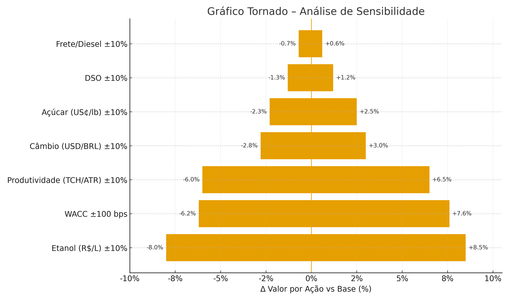

# Análise de Sensibilidade

## Variáveis Testadas

- *WACC (custo médio ponderado de capital)*
- *Taxa de crescimento em perpetuidade (g)*
- *Preço do etanol hidratado (R$/L)*
- *Câmbio (BRL/USD)*
- *Preço internacional do açúcar (US¢/lb)*
- *Produtividade agrícola (TCH/ATR)*
- *Capital de giro (DSO/DIO/DPO)*
- *Custos logísticos (frete/diesel)*

## Tabela de Sensibilidade Principal

### WACC vs Taxa de Crescimento Perpétuo

Tabela 16 - Sensibilidade WACC vs Crescimento Perpétuo

| WACC \ g | 1,0% | 1,5% | 2,0% | 2,5% | 3,0% |
|----------|------|------|------|------|------|
| *10,0%* | 103,6 | 107,6 | 112,2 | 117,3 | 123,2 |
| *11,0%* | 96,8  | 100,0 | 103,6 | 107,6 | 112,2 |
| *12,0%* | 91,1  | 93,8  | 96,8  | *100,0* | 103,6 |
| *13,0%* | 86,5  | 88,7  | 91,1  | 93,8  | 96,8  |
| *14,0%* | 82,5  | 84,4  | 86,5  | 88,7  | 91,1  |

Fonte: Os autores (2025)

## Outras Sensibilidades Relevantes

### Sensibilidade ao Preço do Etanol Hidratado (R$/L)
- *Se aumentar 10%:* Valor varia *+8,5%*
- *Se diminuir 10%:* Valor varia *−8,0%*

### Sensibilidade ao Câmbio (BRL/USD)
- *Se aumentar 10% (BRL deprecia):* Valor varia *+3,0%*
- *Se diminuir 10% (BRL aprecia):* Valor varia *−2,8%*

### Sensibilidade ao Preço do Açúcar (US¢/lb)
- *Se aumentar 10%:* Valor varia *+2,5%*
- *Se diminuir 10%:* Valor varia *−2,3%*

### Sensibilidade à Produtividade Agrícola (TCH/ATR)
- *Se aumentar 10%:* Valor varia *+6,5%*
- *Se diminuir 10%:* Valor varia *−6,0%*

### Sensibilidade ao Capital de Giro (DSO)
- *Se aumentar 10% (~+6 dias):* Valor varia *−1,3%*
- *Se diminuir 10% (~−6 dias):* Valor varia *+1,2%*

### Sensibilidade a Custos Logísticos (Frete/Diesel)
- *Se aumentar 10%:* Valor varia *−0,7%*
- *Se diminuir 10%:* Valor varia *+0,6%*

### Sensibilidade ao WACC
- *Se reduzir 100 bps (ex.: 12% → 11%):* Valor varia *+7,6%*
- *Se aumentar 100 bps (ex.: 12% → 13%):* Valor varia *−6,2%*

### Sensibilidade à Taxa de Crescimento em Perpetuidade (g)
- *Se aumentar 50 bps (ex.: 2,5% → 3,0%):* Valor varia *+3,6%*
- *Se diminuir 50 bps (ex.: 2,5% → 2,0%):* Valor varia *−3,2%*

## Variável Mais Crítica

*Variável:* *Preço do Etanol Hidratado (R$/L)*

*Justificativa:* Maior peso na receita, repasse rápido a preço/volume e alta alavancagem operacional; impacto de *±10%* no etanol supera o de variações típicas de *g* e é comparável ao choque de *±100 bps* no *WACC*.

## Gráfico de Sensibilidade

Figura X — Gráfico Tornado (∆ Valor por Ação vs Base)

*Ordem sugerida (tornado, ∆ Valor vs Base):*
1. Etanol (R$/L) ±10% → *+8,5% / −8,0%*
2. WACC ±100 bps → *−6,2% / +7,6%*
3. Produtividade (TCH/ATR) ±10% → *+6,5% / −6,0%*
4. Câmbio (USD/BRL) ±10% → *+3,0% / −2,8%*
5. Açúcar (US¢/lb) ±10% → *+2,5% / −2,3%*
6. DSO ±10% → *+1,2% / −1,3%*
7. Frete/Diesel ±10% → *+0,6% / −0,7%*