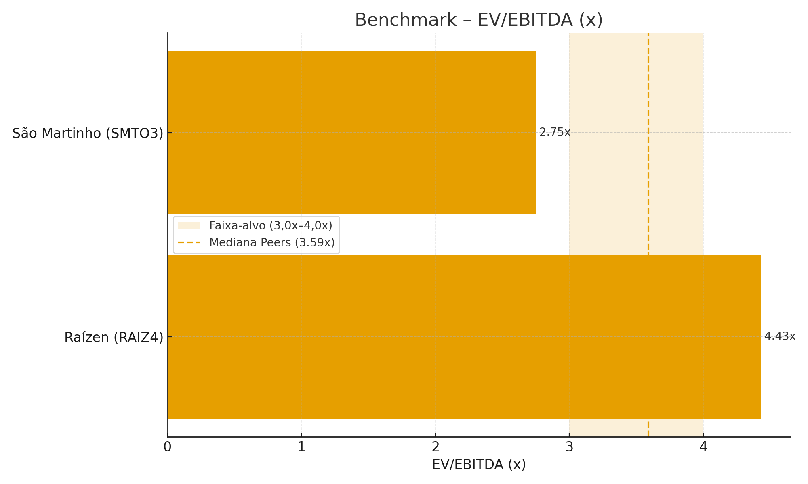
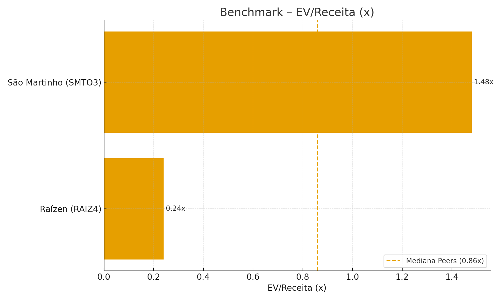

# Benchmarking de Valuation

## Múltiplos da Empresa vs Peers

Tabela 17 - Comparação de Múltiplos (14/out/2025)

| Múltiplo      | Empresa Estudada (Atvos)\* | Raízen (RAIZ4) | São Martinho (SMTO3) | BP Bunge Bioenergia\\ | Mediana Peers |
|---------------|----------------------------|----------------|----------------------|-------------------------|---------------|
| *P/E*       | n.d. (privada)             | n.m.           | *9,99x*            | n.d. (privada)          | *9,99x*     |
| *EV/EBITDA* | n.d. (privada)             | *4,43x*      | *2,75x*            | n.d. (privada)          | *3,59x*     |
| *P/B*       | n.d. (privada)             | *1,09x*      | *0,73x*            | n.d. (privada)          | *0,91x*     |
| *EV/Receita*| n.d. (privada)             | *0,24x*      | *1,48x*            | n.d. (privada)          | *0,86x*     |

Fonte: Os autores (2025).

 Atvos é empresa *privada*; múltiplos de referência via *mediana dos peers* e/ou *múltiplos implícitos* do DCF.  
 BP Bunge Bioenergia é *privada*; não há série pública padronizada de múltiplos.

---

## Análise dos Múltiplos

### Posicionamento Relativo

- *Faixa de referência* (pares listados): *EV/EBITDA ~2,8x–4,4x* e *EV/Receita* ~0,24x–1,48x, com *medianas* de *3,59x* (EV/EBITDA) e *0,86x* (EV/Receita).  
- Como companhia *privada*, a Atvos não “negocia” em bolsa; para fins comparativos, a *mediana dos peers* é a âncora adequada.  
- Em ciclos favoráveis (etanol forte / açúcar alto / BRL fraco), players mais *diversificados* (ex.: Raízen) tendem a ficar *acima da mediana*; quando o foco é *eficiência agroindustrial* (ex.: São Martinho), o *EV/EBITDA* pode ficar *mais comprimido, com *menor volatilidade*.

### Justificativas para Diferenças

1. *Mix & Diversificação*: etanol 2G/biometano, trading/distribuição e integração logística → *prêmio* (menor volatilidade de caixa).  
2. *Eficiência Agroindustrial*: *TCH/ATR* e disponibilidade industrial elevadas sustentam múltiplos em ciclos adversos.  
3. *Qualidade de Receita*: *PPAs* e *CBIOs* aumentam previsibilidade → menor desconto de risco → múltiplos ↑.  
4. *Estrutura de Capital*: menor alavancagem e melhor duration de dívida → WACC ↓ → múltiplos ↑.  
5. *Governança/Disclosure*: listadas com reporting robusto tendem a negociar com *prêmio* vs. privadas.

---

## Gráfico Comparativo

Figura 1 — Benchmark EV/EBITDA (x) com faixa-alvo e mediana

Notas: Banda sombreada = *faixa-alvo 3,0x–4,0x; linha tracejada = **mediana de peers (3,59x)*.

---

Figura 2 — Benchmark EV/Receita (x) com mediana

Nota: linha tracejada = *mediana de peers (0,86x)*.
